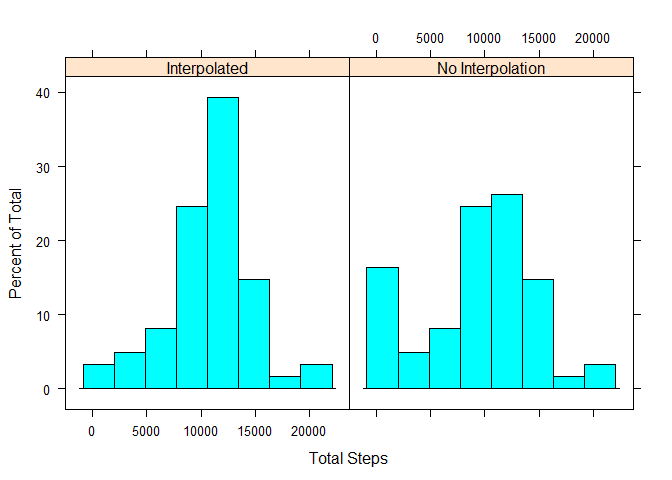

# Reproducible Research: Peer Assessment 1


## Loading and preprocessing the data
The variables included in this dataset are:

- steps: Number of steps taking in a 5-minute interval (missing values are coded as NA)

- date: The date on which the measurement was taken in YYYY-MM-DD format

- interval: Identifier for the 5-minute interval in which measurement was taken

The dataset is stored in a comma-separated-value (CSV) file and there are a total of 17,568 observations in this dataset. The code for this analysis assumes the dataset is in a file named "activity.csv" in the activity subdirectory of the working
directory. 

The data is read in using read.csv, and the date is parsed using lubridate. 


```r
library(lubridate)
data <-read.csv("./activity/activity.csv")
data <- transform(data, date = ymd(as.character(date)))
```


## What is the mean total number of steps taken per day?


```r
## group by day and calculate total steps per day, and the mean and
## median of the total steps across all the days.
library(dplyr)
library(lattice)
data_by_date <- group_by(data, date)
total_steps <- summarise(data_by_date, total_steps = sum(steps, na.rm = TRUE))
histogram(total_steps$total_steps, xlab = "Total Steps")
```

 

```r
mean_steps <- mean(total_steps$total_steps)
median_steps <- median(total_steps$total_steps)
```
The mean daily step total is 9354.23.
The median daily step total is 10395.

## What is the average daily activity pattern?

```r
# group by interval and average the number of steps per interval across the
# days. 
data_by_int <- group_by(data, interval)
interval_avg <- summarise(data_by_int, mean = mean(steps, na.rm = TRUE))
plot(interval_avg, type = "l", ylab = "Mean steps", xlab = "Interval")
```

 

```r
# calculate the average number of steps taken across the days
# during each interval. Add it to the dataset in a column called 
# "abisteps", which means average by interval steps. 
# Calcuate which interval has the highest mean steps. 
data <- transform(data, interval = as.factor(interval))
data <- transform(data, abisteps = ave(data$steps, interval,
                                       FUN = function(x) mean (x, na.rm = TRUE)))
most_active <- interval_avg[which(interval_avg$mean == 
                                    max(interval_avg$mean)),1]
```

The interval with the highest average number of steps is 835.


## Imputing missing values


```r
# calulate and report the number of missing values in the dataset.
number_missing <- sum(is.na(data$steps))
```
There are 2304 missing values. 


```r
#create an interpolated dataset where NA values in the steps column
#are replaced with the average number of steps taken during that interval.
interpolated_data <- transform(data, steps = ifelse(is.na(steps), 
                                                    abisteps, steps))
# plot histograms of the average number of steps per day for both the
# original data and the interpolated data. 
interpolated_by_date <- group_by(interpolated_data, date)
interpolated_total_steps <- summarise(interpolated_by_date, 
                                      total_steps = sum(steps, na.rm = TRUE))
interpolated_total_steps <- mutate(interpolated_total_steps, int = "Interpolated")
total_steps <- mutate(total_steps, int = "No Interpolation")
hist_data <- rbind(total_steps, interpolated_total_steps)
histogram(~ hist_data$total_steps | hist_data$int, xlab = "Total Steps")
```

 

```r
int_mean_steps <- mean(interpolated_total_steps$total_steps)
int_median_steps <- median(interpolated_total_steps$total_steps)
```

The mean total steps per day before interpolation was 9354.23.
The mean total steps per day for the interpolated data was 10766.19.

The difference is -1411.96

The median total steps per day before interpolation was 10395.
The median total steps per day for the interpolated data was 10766.19.

The difference was -371.19.

## Are there differences in activity patterns between weekdays and weekends?

```r
## compare weekday and weekend activity levels.
## Add a factor to the interpolated data that labels each reading as "weekday
## or "weekend". Group the data by that factor and by interval. Sum the steps.

w_int_data <- transform(interpolated_data, 
                        w = as.factor(ifelse(wday(date)== 7 | wday(date)== 1,
                                             "weekend", "weekday")))
wdata_grouped <- group_by(w_int_data, w, interval)
wdata_sum <- summarise(wdata_grouped, steps = sum(steps))

## graph the two subsets using lattice xyplot. 
library(lattice)
p <- xyplot(steps ~ interval | w, wdata_sum, layout = c(1,2), type = "l")
print(p)
```

 


There were clear differences in the activity levels. Participants were generally more active on weekdays, with the most activity occurring on weekday mornings. 
